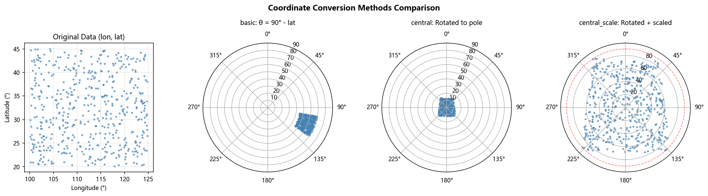
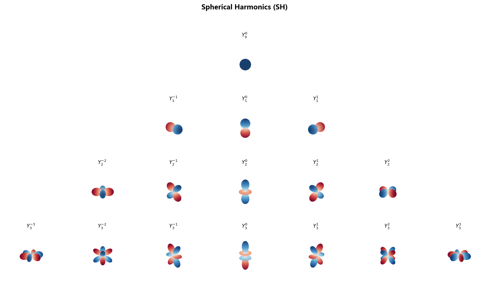
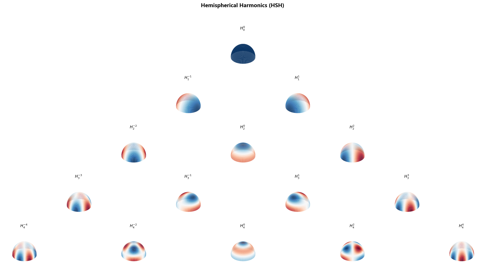
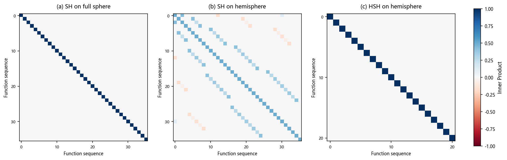
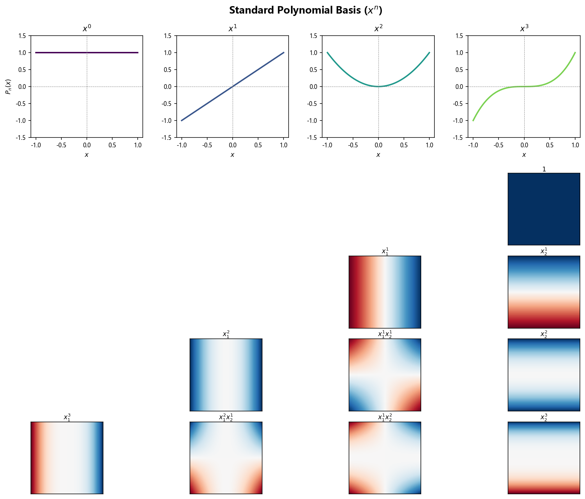
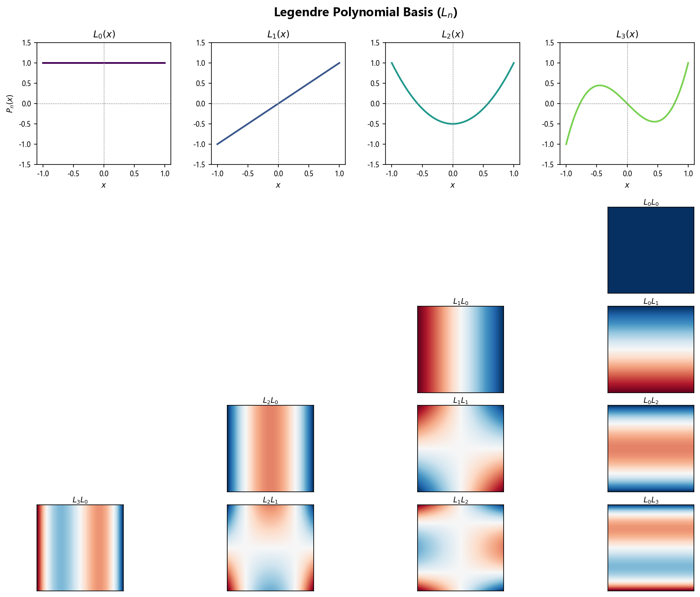
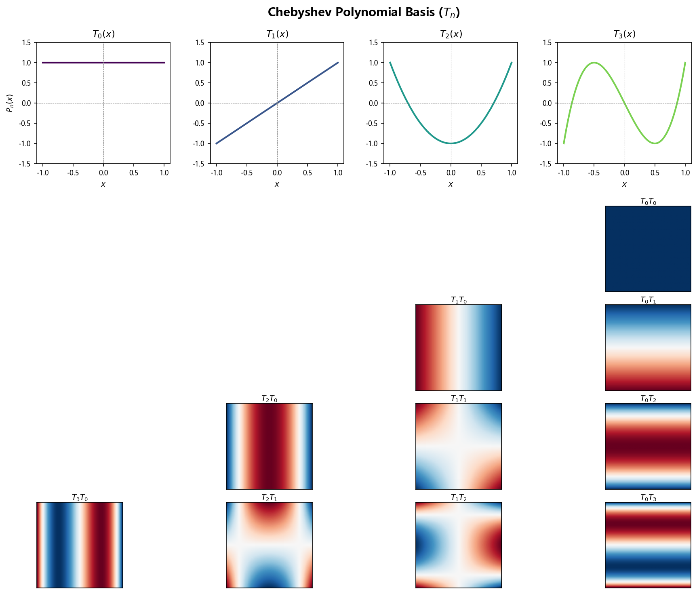
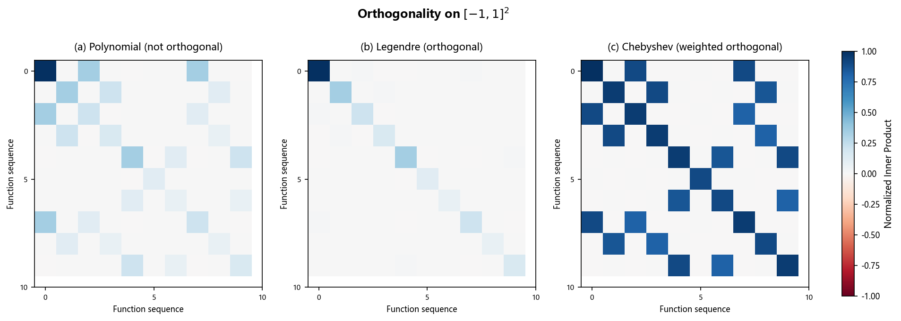
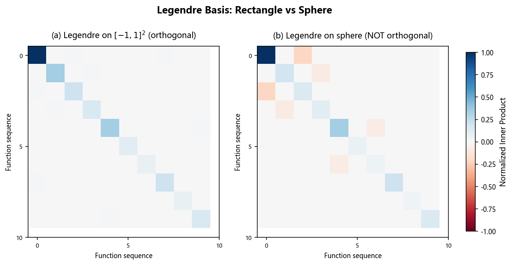

# Spatial Basis

兼容 scikit-learn API 的空间基函数变换器，支持球谐函数（Spherical Harmonics, SH）和半球谐函数（Hemispherical Harmonics, HSH），用于空间回归建模。

---

## 安装

```bash
pip install .
# 或使用 uv
uv pip install .
```

---

## 快速示例

```python
import numpy as np
from spatial_basis import SphericalHarmonicsBasis

# 准备数据
X = np.column_stack([lon, lat])

# 初始化
basis = SphericalHarmonicsBasis(
    degree=2,
    cup=True,
    coords_convert_method='central_scale'
)

# 生成设计矩阵
basis.fit(X)
X_design = basis.transform(X)

# 或一步到位
X_design = basis.fit_transform(X)
```


---

## 球谐基函数

---

### 参数列表

| 参数 | 类型 | 默认值 | 说明 |
| :--- | :--- | :--- | :--- |
| `degree` | int | 2 | 球谐函数最高阶数（见下文“球谐函数”） |
| `cup` | bool | `True` | 是否使用半球谐函数（见下文“半球谐函数”） |
| `coords_convert_method` | str | `'central_scale'` | 坐标转换方法（见下文“坐标转换”） |
| `pole` | str/tuple | `'xyzmean'` | 极点位置（见下文“坐标转换”） |
| `hemisphere_scale` | str/float | `'auto'` | 半球缩放比例（见下文“坐标转换”） |
| `include_bias` | bool | `True` | 是否包含常数项 $Y_{0,0}$ |
| `force_norm` | bool | `False` | 强制列归一化 |

---

### 坐标转换

**坐标转换**将原始数据的经纬度坐标转换至球坐标

$$
(lon, lat) \to (\theta, \phi)
$$

其中：

- $\theta \in [0, \pi]$：天顶角（余纬），$\theta=0$ 对应北极，$\theta=\pi$ 对应南极

- $\phi \in [0, 2\pi]$：方位角（经度）

  

**坐标转换方法** `coords_convert_method` 根据数据在球面上的分布选择

| 配置              | 转换方法                                 | 适用场景                                |
| ----------------- | ---------------------------------------- | --------------------------------------- |
| `'non'`           | 不转换                                   | 全球覆盖数据，用户输入 $(\theta, \phi)$ |
| `'basic'`         | 转换余纬 $\theta = \pi/2 - \text{lat}$ | 全球覆盖数据，用户输入 $(lon, lat)$     |
| `'central'`       | 将数据中心旋转到北极                     | 局域覆盖数据，用户输入 $(lon, lat)$     |
| `'central_scale'` | 旋转 + 缩放到半球边界                    | 局域覆盖数据，用户输入 $(lon, lat)$     |




**极点参数** `pole` 指定旋转的目标极点（仅 `'central'` 和 `'central_scale'` 时生效）

| 配置           | 极点位置                         |
| -------------- | -------------------------------- |
| `'xyzmean'`    | 将数据的三维笛卡尔质心作为新北极 |
| `'haversine'`  | 使用球面距离的几何中心           |
| `(lat0, lon0)` | 手动指定极点位置                 |

- 选择 `'xyzmean'`，`'haversine'` 配置时，极点位置 $(lat_0, lon_0)$ 在  `basis.fit` 过程中计算并保存于 `basis`内部

  

**缩放参数** `hemisphere_scale`：控制缩放比例（仅 `'central_scale'` 时生效）

- `'auto'`（默认）：`cup=True` 时为 0.5，`cup=False` 时为 1.0

- 数值 (0, 1.0]：手动指定缩放因子，如 0.5 表示缩放至 180*0.5=90 °

  


---

### 球谐函数

**球谐函数** $Y_{l,m}$ 定义为

$$
Y_{l,m}(\theta, \phi) = \sqrt{\frac{2l+1}{4\pi} \cdot \frac{(l-m)!}{(l+m)!}} \, P_l^{|m|}(\cos\theta)
\left\lbrace
\begin{array}{ll}
\sqrt{2} \cos(m\phi) & m > 0 \\\\
1 & m = 0 \\\\
\sqrt{2} \sin(|m|\phi) & m < 0
\end{array}
\right.
$$
其中， $l$ 为阶数（degree）；$m$ 为阶次（order）；$P_l^m(x)$ 为伴随勒让德多项式，包含 $(-1)^m$ 相位。


**可视化**（红色为正值，蓝色为负值）：




**设计矩阵**：$B\in \mathbb{R}^{N \times K}$ 由 $N$ 个样本的 $K$ 个球谐函数值组成。$B_{ij}$ 表示第 $i$ 个样本坐标 $(\theta_i, \phi_i)$ 对应的第 $j$ 个球谐函数值：

$$
B_{ij} = Y_{l,m}(\theta_i, \phi_i)
$$

球谐函数数量  $K=(L+1)^2$ 由最高阶次  $L$ 决定


**参数说明**：

- `degree`：设计矩阵中球谐函数的最高阶数 $L$

- `include_bias`：是否包含 $Y_{0,0}$ 常数项（默认 `True`）

  

---

### 半球谐函数

标准球谐函数在半球区域 $\Omega_{\text{HS}} = \{\theta \in [0, \pi/2], \phi \in [0, 2\pi]\}$不再正交，通过以下方式：

1. 筛选偶数项：仅保留满足 $l+m \equiv 0 \pmod{2}$ 的项
2. 重新归一化：在半球上归一化

可构造在半球区域正交归一化的的 **半球谐函数**  $H_{l,m}$：

$$
H_{l,m}(\theta, \phi) = \sqrt{2} \, Y_{l,m}(\theta, \phi),    \text{ if } (l+m) \text{ is even}
$$


**可视化**：




**参数说明**：

- `cup=True`：使用半球谐函数（HSH）
- `cup=False`：使用标准球谐函数（SH）

**使用示例**（区域数据）：

```python
import numpy as np
from spatial_basis import SphericalHarmonicsBasis

# 区域数据（如中国）
X = np.column_stack([lon, lat])
basis = SphericalHarmonicsBasis(
    degree=5, 
    cup=True,  # 使用 HSH
    coords_convert_method='central_scale'
)
X_design = basis.fit_transform(X)
```


---

### 正交归一化性质

球谐函数/半球谐函数 在各自的定义域上（球面/半球面）上具有正交归一化性质。定义内积为：

$$
\langle f_i, f_j \rangle = \int_{\Omega} f_i(\theta, \phi) \, f_j(\theta, \phi) \, d\Omega
$$

其中 $d\Omega = \sin\theta \, d\theta \, d\phi$ 为球面测度，$\Omega$ 为积分域。正交归一化基函数满足：

$$
\langle f_i, f_j \rangle = \delta_{ij}
$$

通过 Gram 矩阵验证（对角线=1，非对角线≈0 表示正交）：



**验证结果**：
- **(a) SH 在全球**：正交归一化（对角线=1，非对角线≈0）
- **(b) SH 在半球**：失去正交性（对角线=1/2，非对角线≠0）
- **(c) HSH 在半球**：正交归一化（对角线=1，非对角线≈0）


---

## 多项式基函数

`PolynomialBasis` 是一个兼容 sklearn 的 2D 多项式基函数变换器，将 2 维输入 $(x_1, x_2)$ 转换为多项式特征设计矩阵。

---

### 参数

| 参数 | 类型 | 默认值 | 说明 |
| :--- | :--- | :--- | :--- |
| `degree` | int | 2 | 多项式最高阶数 |
| `include_bias` | bool | `True` | 是否包含常数项 1 |
| `basis` | str | `'polynomial'` | 基函数类型 |

---

### 基函数类型

| 配置 | 基函数 | 说明 |
| :--- | :--- | :--- |
| `'polynomial'` | $x_1^i \cdot x_2^j$ | 标准幂多项式 |
| `'legendre'` | $L_i(x_1) \cdot L_j(x_2)$ | Legendre 多项式 |
| `'chebyshev'` | $T_i(x_1) \cdot T_j(x_2)$ | Chebyshev 多项式 |

---

### 设计矩阵

对于 `degree=d`，生成所有满足 $i + j \le d$ 的项，特征数量为：

$$
K = \frac{(d+1)(d+2)}{2}
$$

例如 `degree=2` 时，生成 6 个特征：

$$
1, \quad x_1, \quad x_2, \quad x_1^2, \quad x_1 x_2, \quad x_2^2
$$

---

### 归一化

在 `fit` 阶段记录输入数据的最小/最大值，`transform` 时将输入归一化到 $[-1, 1]$：

$$
x \to 2 \cdot \frac{x - x_{\min}}{x_{\max} - x_{\min}} - 1
$$

这对 Legendre 和 Chebyshev 多项式尤为重要，因为它们在 $[-1, 1]$ 区间上具有良好的数值性质。

---

### 使用示例

```python
import numpy as np
from spatial_basis import PolynomialBasis

# 准备数据
X = np.column_stack([lon, lat])

# 使用 Legendre 多项式
basis = PolynomialBasis(degree=3, basis='legendre')
X_design = basis.fit_transform(X)

print(basis.get_feature_names_out())
# ['1', 'x0', 'x1', 'L2(x0)', 'x0 x1', 'L2(x1)', 'L3(x0)', ...]
```

---

### 可视化

**标准多项式**（上：1D 曲线，下：2D 热力图金字塔）：



**Legendre 多项式**：



**Chebyshev 多项式**：



---

### 正交性分析

多项式基函数在 $[-1,1]^2$ 矩形域上的正交性：



- **(a) Polynomial**：不正交（非对角元素非零）
- **(b) Legendre**：正交（对角线为主）
- **(c) Chebyshev**：带权重正交

**注意**：Legendre 和 Chebyshev 多项式在球面上**失去正交性**：



这是因为球面积分测度 $d\Omega = \sin\theta \, d\theta \, d\phi$ 与矩形域 $dx_1 dx_2$ 不同。对于球面数据，应使用**球谐函数**而非多项式基函数。
